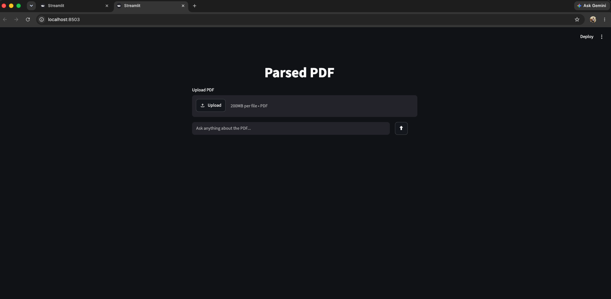
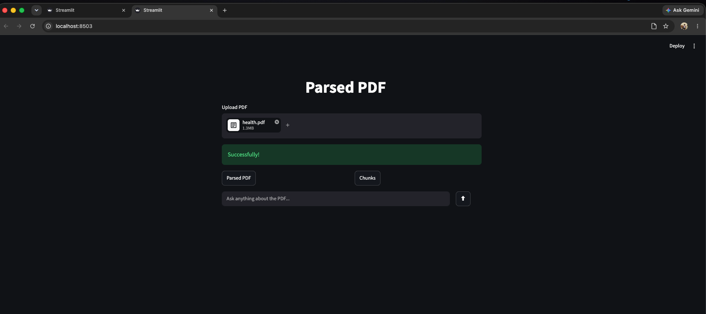
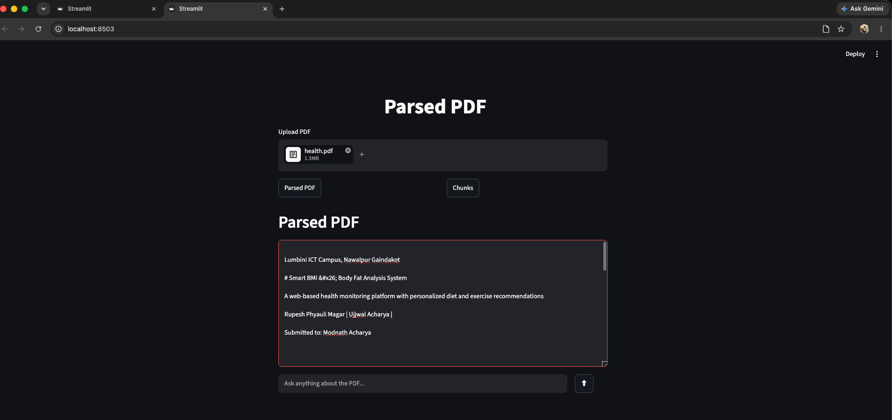
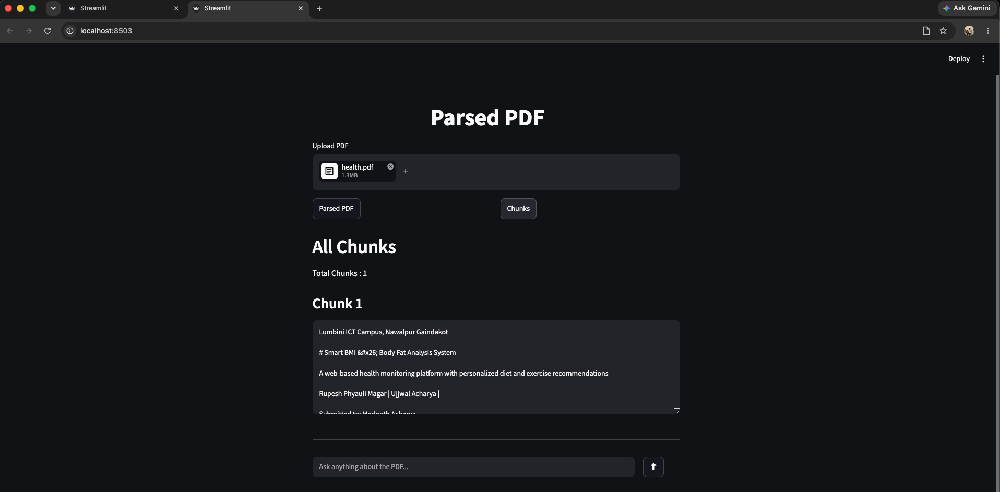
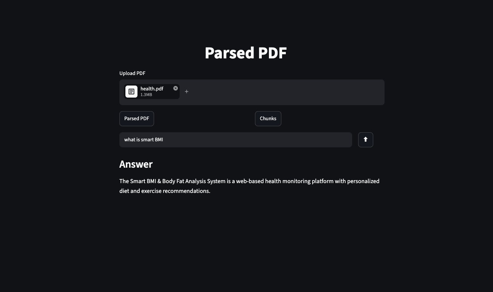

# PDF RAG Chatbot

A Retrieval-Augmented Generation (RAG) chatbot built with **Streamlit**, **LlamaParse**, **Sentence Transformers**, **FAISS**, and **Google Gemini 2.5 Flash**. The application allows users to upload a PDF, process its contents, and ask natural language questions that are answered using only the information contained in the uploaded document.

---

#  Features

* Upload any PDF document
* Parse PDF into Markdown using LlamaParse
* Automatically split the document into semantic chunks
* Generate vector embeddings using the BAAI BGE embedding model
* Store embeddings in a FAISS vector database
* Retrieve the most relevant chunks for each user query
* Generate answers using Google Gemini 2.5 Flash
* Interactive Streamlit web interface

---

#  Technologies Used

* Python
* Streamlit
* LlamaParse
* Sentence Transformers (BAAI/bge-small-en-v1.5)
* FAISS
* Google Gemini 2.5 Flash
* LangChain Text Splitters
* NumPy

---

# Project Structure

```
PDF-RAG-Chatbot/
│
├── pdf_ragbot.py
├── create_llamaparse.py
├── requirements.txt
├── .env
├── images/
├── markdowns_20/
└── README.md
```

---

# Project Workflow

## Step 1 — Parse the PDF

The project starts by uploading a PDF through the Streamlit interface.

The uploaded PDF is sent to **LlamaParse**, which converts the document into structured Markdown format while preserving headings, paragraphs, and tables.

The parsed Markdown is also saved locally for future reference.

---

## Step 2 — Store API Keys

API keys are stored securely in a `.env` file.

```
LLAMA_PARSE_KEY=your_llamaparse_api_key
GEMINI_API_KEY=your_google_ai_studio_api_key
```

The application loads these keys using `python-dotenv`.

---

## Step 3 — Chunk the Document

The Markdown document is divided into smaller chunks using LangChain's `RecursiveCharacterTextSplitter`.

Configuration:

* Chunk Size: **1000**
* Chunk Overlap: **150**

Chunking improves retrieval accuracy by allowing the system to search smaller, more relevant sections of the document.

---

## Step 4 — Generate Embeddings

Each chunk is converted into a vector embedding using:

```
BAAI/bge-small-en-v1.5
```

Sentence Transformers converts every chunk into a numerical representation that captures its semantic meaning.

---

## Step 5 — Create the Vector Database

The embeddings are stored inside a **FAISS IndexFlatIP** vector database.

FAISS enables fast similarity search across all document chunks.

---

## Step 6 — Retrieval

When a user asks a question:

1. The question is converted into an embedding.
2. FAISS compares it with all stored chunk embeddings.
3. The top matching chunks are retrieved.
4. Those retrieved chunks become the context for the language model.

---

## Step 7 — Answer Generation

The retrieved context is combined with the user's question and sent to **Google Gemini 2.5 Flash**.

The prompt instructs the model to answer **only using the retrieved document context**.

If the answer is not present in the document, the chatbot responds that the information is unavailable.

---

# RAG Pipeline

```
PDF Upload
      │
      ▼
LlamaParse
      │
      ▼
Markdown
      │
      ▼
Chunking
      │
      ▼
Embeddings (BGE)
      │
      ▼
FAISS Vector Database
      │
      ▼
Similarity Search
      │
      ▼
Relevant Chunks
      │
      ▼
Gemini 2.5 Flash
      │
      ▼
Final Answer
```

---

# Application Screenshots

## Home Page



---

## Upload PDF



---

## Parsed PDF



---

## Chunked Document



---

## Question Answering



---

# Installation

Clone the repository

```bash
git clone https://github.com/YOUR_USERNAME/YOUR_REPOSITORY.git
```

Move into the project directory

```bash
cd YOUR_REPOSITORY
```

Create a virtual environment

```bash
python -m venv venv
```

Activate the virtual environment

### Windows

```bash
venv\Scripts\activate
```

### macOS/Linux

```bash
source venv/bin/activate
```

Install dependencies

```bash
pip install -r requirements.txt
```

Create a `.env` file

```
LLAMA_PARSE_KEY=your_llamaparse_api_key
GEMINI_API_KEY=your_google_ai_studio_api_key
```

Run the application

```bash
streamlit run pdf_ragbot.py
```

---

# Future Improvements

* Chat history
* Multiple PDF support
* Source citation for retrieved chunks
* Streaming responses
* Conversation memory
* Hybrid search (keyword + vector search)

---

#  Author

**Rupesh Phyauli Magar**

This project was built to demonstrate a complete Retrieval-Augmented Generation (RAG) pipeline for PDF-based question answering using modern AI technologies.
